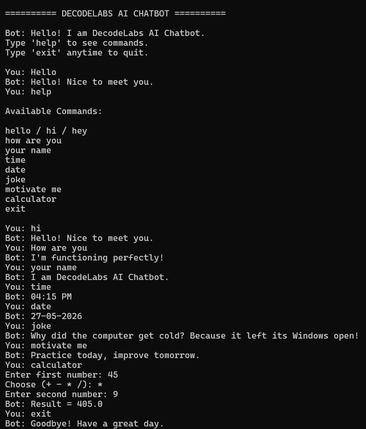
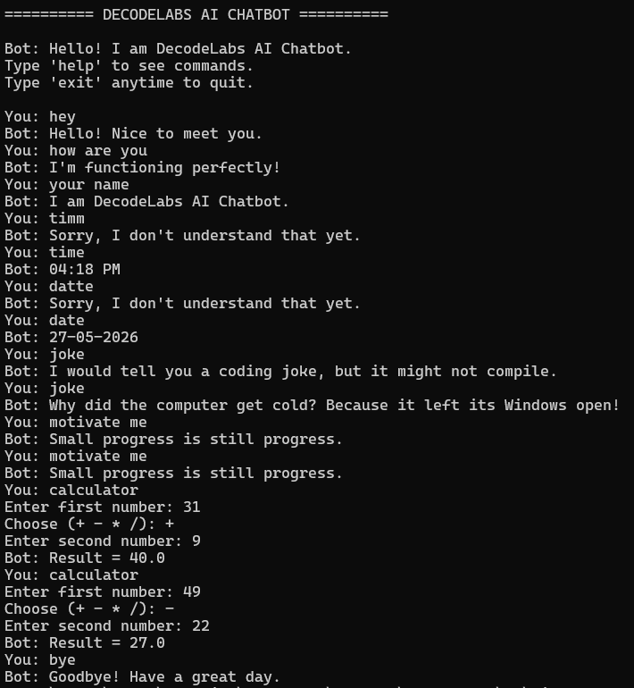

# AI Rule-Based Chatbot

**Project 1 — DecodeLabs AI Industrial Training Kit 2026**

---

## 📌 Overview
A Python-based rule-based chatbot built using control flow and decision-making logic.

---

##🚀 Features

- Continuous chat loop  
- Greetings & exit handling  
- Rule-based responses  
- Time & date commands  
- Joke & motivation generator  
- Simple calculator  
- Help menu  

##🛠 Technologies

- Python  
- If-Else Logic  
- Control Flow  
- Rule-Based AI Concepts  

##▶️ Run

```bash
python project1.py
```

##🧾 Example Commands

```text
hi
your name
time
joke
calculator
help
exit
```

## 📸 Output Screenshots 

### Sample Output 
 



##🎯 Conclusion

This project demonstrates the fundamentals of AI chatbot development using predefined rules, logical decision making, and interactive user communication.
