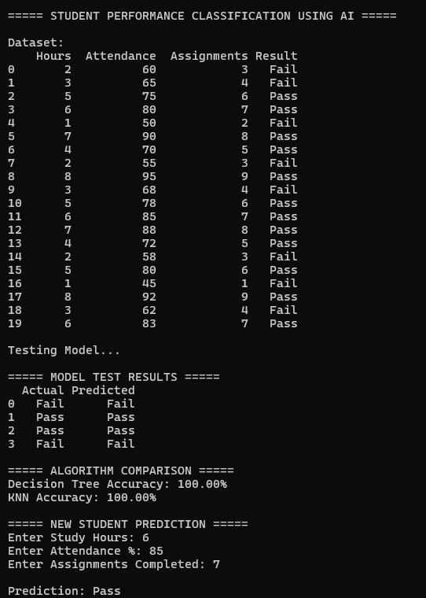
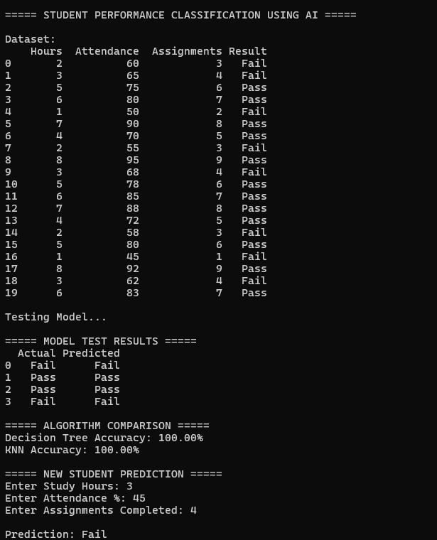

# Student Performance Classification Using AI

## Project 2 — DecodeLabs AI Industrial Training Kit 2026

---

## 📌 Overview
A Python-based Machine Learning system that predicts whether a student will **Pass or Fail** using academic performance data such as study habits, attendance, and assignment completion.

---

## 🚀 Features
- Student performance prediction system (Pass/Fail)
- Multiple ML model comparison
- K-Nearest Neighbors (KNN) implementation
- Decision Tree Classifier implementation
- Accuracy evaluation and comparison
- User input-based prediction system

---

## 🛠 Technologies Used
- Python
- Machine Learning
- Scikit-learn (if used)
- Classification Algorithms
- Data Preprocessing

---

## ▶️ How To Run

```bash
python p2.py
```

## 🧾 Example Input
```
Study Hours: 5  
Attendance: 80  
Assignments Completed: 6
```
## 📊 Example Output
```
Prediction: PASS  
Model Accuracy: 92%  
Best Algorithm Used: Decision Tree / KNN
```
## 📸 Output Screenshots

### Sample Output




## 🎯 Conclusion

This project demonstrates a simple AI-based classification system using Machine Learning algorithms to predict student academic performance. It uses multiple models, compares accuracy, and provides user input-based predictions, making it a practical example of real-world AI decision systems.

