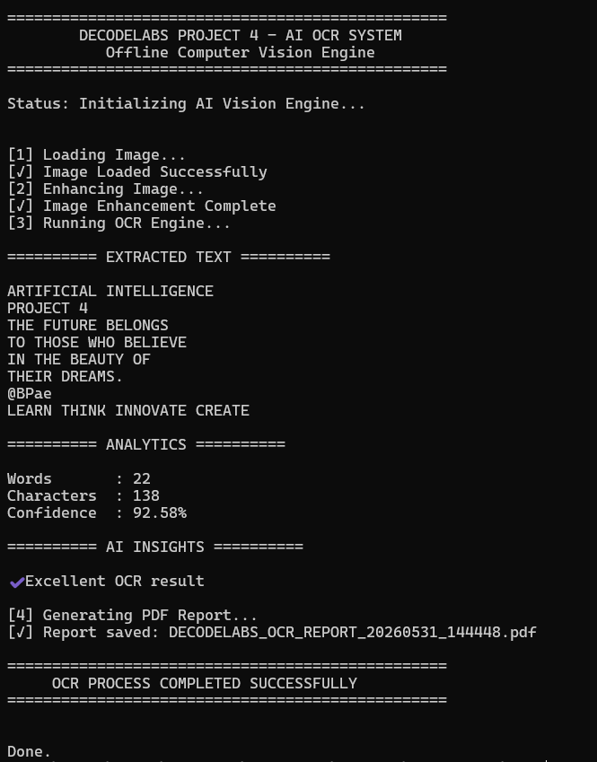

# 🧠 AI OCR System  
## Project 4 — DecodeLabs AI Industrial Training Kit 2026  

---

## 📌 Overview  
A Python-based AI Optical Character Recognition (OCR) system that extracts text from images using Tesseract OCR. The system includes image preprocessing, confidence scoring, analytics, and automatic PDF report generation.

---

## 🚀 Features  

- Image upload via file selector  
- AI-based text extraction using Tesseract OCR  
- Image preprocessing (grayscale + noise reduction + thresholding)  
- Confidence scoring system  
- Word and character analytics  
- AI-based quality insights  
- Automatic PDF report generation  
- Highlighted OCR workflow output  

---

## 🛠 Technologies Used  

- Python  
- OpenCV (Image Processing)  
- PyTesseract (OCR Engine)  
- NumPy  
- Tkinter (File Picker GUI)  
- ReportLab (PDF Generation)  

---

## ▶️ How To Run  

```bash
python p4.py
```

## 📥 Input Example
Select image file (.png / .jpg / .jpeg)

## 📤 Output Example
```
========== EXTRACTED TEXT ==========

Optical Character Recognition
Image Preprocessing
Text Extraction

========== ANALYTICS ==========

Words       : 39
Characters  : 236
Confidence  : 87.44%

========== AI INSIGHTS ==========

✔ Excellent OCR result
```

## 📄 Generated Output

```
Extracted text displayed in terminal
Confidence score calculated
PDF report saved automatically
```


## 📸 Output Screenshots

### Sample Output


## 🏁 Conclusion  

The AI OCR System (Project 4) successfully demonstrates a complete end-to-end computer vision pipeline using Python. It integrates image preprocessing, optical character recognition, and intelligent analytics to extract meaningful text from images with measurable confidence scoring.
This project highlights the practical application of AI in real-world scenarios such as document digitization, automated data extraction, and smart reporting systems. The addition of PDF report generation further enhances its usability as a professional-grade tool.
Overall, this project strengthens core skills in computer vision, AI workflow design, and Python-based application development, making it a strong foundation for advanced AI systems.

